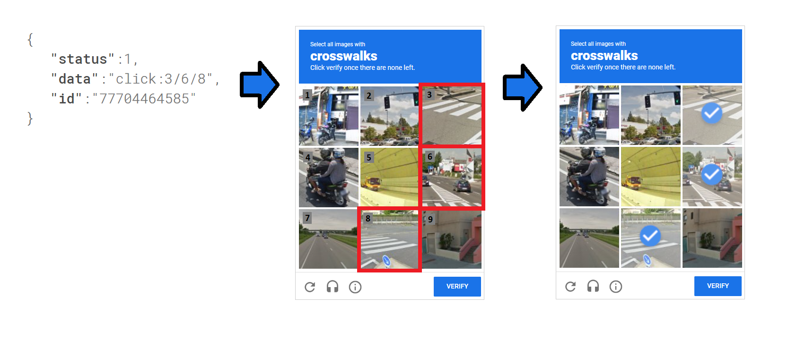
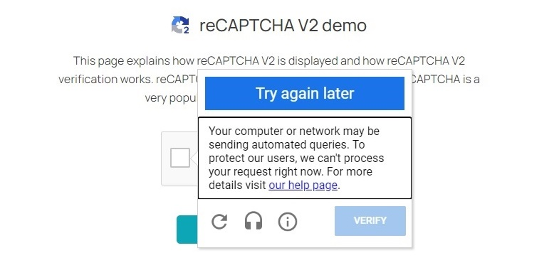

# Puppeteer reCAPTCHA V2 Solver Using Clicks

This repository demonstrates how to automate image-based [reCAPTCHA bypass] challenges (3x3 or 4x4 grids) using the [reCAPTCHA solver] and Puppeteer lib
using [Puppeteer] and the [2Captcha] service. The script programmatically interacts with reCAPTCHA, extracts the challenge, submits it to 2Captcha ([captcha solver]) for processing, and then simulates human-like clicking on the solution provided.


If you're working with Python, we also have a similar example that uses Python along with Selenium. You can find the example in the repository titled [reCAPTCHA Solver Using 2Captcha and Selenium].

## Installation and Usage

To use this script, clone the repository, install the dependencies, and run the example:

```sh
# Clone the repository
git clone git@github.com/2captcha/puppeteer-recaptcha-solver-using-clicks.git
cd puppeteer-recaptcha-solver-using-clicks

# Install dependencies
npm install

# Run the script
npm run start
```

## Configuration
To use the script, you'll need to configure your [2Captcha] API key. Set the `APIKEY` environment variable as follows:

```sh
export APIKEY=your_api_key
```

>Alternatively, you can set the `APIKEY` value directly in the code. To do this, modify the API key value in the following file: [`captchaSolver.js`, line 7]. Locate the line that assigns the API key and replace its current value with your actual API key. This approach is useful for quick testing or if environment variables aren’t available. However, for production environments, it’s recommended to use environment variables for better security.

You can obtain your API key from your [2Captcha account](https://2captcha.com/enterpage).

## How It Works

This script uses the **[Grid]** method to solve the reCAPTCHA. Here's a breakdown of the process:

1. **Extracting the Challenge**: The original captcha image and relevant parameters are extracted.
2. **Sending Data to 2Captcha**: The image data is sent to 2Captcha, where it is solved by using the [grid] method.
3. **Clicking on the Solution**: Once the solution is received, containing the cell numbers that need to be clicked, the Puppeteer script interacts with the reCAPTCHA widget and clicks the specified cells. Then, the "Verify" button is pressed to complete the challenge.

Example of a successful response from the extraction script:
```js
{
  rows: 3,
  columns: 3,
  type: 'GridTask',
  comment: 'Select all images with crosswalks Click verify once there are none left',
  body: 'iVBORw0KGgoAAAANSUhEUgAAASwAAAEsCAYAAAB5fY51AAAAAXNSR0...'
}
```

Example of a response after solving the reCAPTCHA:

```
{ status: 1, data: 'click:3/6/8', id: '77704464585' }
```

In the response `click:3/6/8`, the numbers indicate which cells need to be clicked. The received response `click:3/6/8` means that you need to click on the captcha squares numbered 3, 6, and 8. The counting of squares starts from the top left corner. In the screenshot below, you can visually see which squares need to be clicked for the response `click:3/6/8`.


<figcaption style="text-align: center;">Visually answer `click:3/6/8`</figcaption>

Typically, to successfully solve a captcha, you need to solve around 1-5 challenges, but in more complex cases, there may be more tasks. 

## Advantages of This Approach
- **Token-Free Verification**: There is no need to manually manage or inject the token into the web page. Instead, we mimic human behavior by clicking on the correct areas.
- **Simplified Logic**: It leverages the built-in verification process that comes with reCAPTCHA, simplifying the token handling process

The main advantage of this approach is that you don't have to figure out how to apply the token on the page.
Using this approach, you simply click on the correct squares, and click the check button, and after that the built-in logic of checking the reCAPTCHA response works out. 

The reCAPTCHA solution can be significantly complicated, for security purposes, sites can use additional parameters such as `datas` or implement complex token verification logic.
Using this click-through approach is ideal in cases where bypassing reCAPTCHA using token is intentionally difficult.

## Disadvantages of This Approach
- **Increased Complexity**: Requires more code and more time to handle all interactions.
- **Variable Cost and Speed**: The cost and time required to solve captchas may vary depending on the complexity of each image challenge.
- **Browser Automation Dependency**: Browser automation is required to ensure the correct functionality of the reCAPTCHA code. The automation facilitates the necessary logic for applying the reCAPTCHA token effectively, making sure the process works as intended..

## Potential Errors
- **"ERROR_CAPTCHA_UNSOLVABLE"**: Occasionally, the captcha may be too difficult for 2Captcha to solve, and an error is returned. Implement error-handling logic to retry or escalate if this occurs.
- **Blocking by reCAPTCHA**: If too many attempts are made from a single IP, reCAPTCHA might temporarily block requests. In such cases, changing the IP or waiting a few minutes might help.  When you encounter a temporary ban from reCAPTCHA, you will receive the following message: `Try again later. Your computer or network may be sending automated queries. To protect our users, we can't process your request right now...`


<figcaption style="text-align: center;">Blocking from reCAPTCHA</figcaption>

To change the IP address, you can use a residential [proxy service].

## Planned Features
- Automatic image refresh handling for updated captchas.
- Use CSS selectors instead of absolute coordinates for more reliable clicking.
- Better error handling, especially for "ERROR_CAPTCHA_UNSOLVABLE".

## Useful Links
- [Script used to extract captcha parameters](https://gist.github.com/kratzky/20ea5f4f142cec8f1de748b3f3f84bfc)
- [reCAPTCHA Bypass using the Grid Method](https://2captcha.com/blog/recaptcha-recognition-using-grid-method)


## Related Projects
- [Python & Selenium reCAPTCHA Solver using 2Captcha](https://github.com/2captcha/selenium-recaptcha-solver-using-grid)

<!-- Shared links -->
[2Captcha]: https://2captcha.com/
[reCAPTCHA solver]: https://2captcha.com/
[captcha solver]: https://2captcha.com
[2captcha account]: https://2captcha.com/enterpage
[reCAPTCHA bypass]: https://2captcha.com/p/bypass-recaptcha
[Grid]: https://2captcha.com/2captcha-api#grid
[proxy service]: https://2captcha.com/proxy/residential-proxies
[reCAPTCHA Solver Using 2Captcha and Selenium]: https://github.com/2captcha/selenium-recaptcha-solver-using-grid
[Puppeteer]: https://pptr.dev/
[`captchaSolver.js`, line 7]: ./captchaSolver.js#L7
